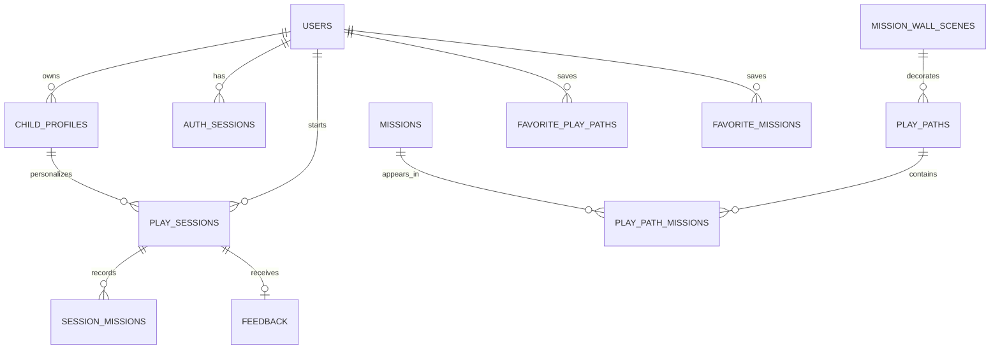

# Play Spark — Database Design

**Version:** 1.2 — Private Beta  
**Status:** Design baseline  
**Scope:** Database only; API design is intentionally deferred.
**Last updated:** 21 September 2026

## 1. Purpose

This document defines how Play Spark stores its developer-curated activity library and each parent’s private app data. Play Spark is a parent-led, screen-free activity planner for preschoolers.

The model is designed to be simple for rthe beta and expandable late. The beta interface supports one active child profile per parent account, while the database can support more profiles if a future plan permits it.

## 2. Database platform and environments

**Database:** MongoDB Atlas  
**Backend access:** Node.js/Express API only; the browser never connects directly to MongoDB.

Two databases are used in the existing Atlas cluster:

| Database | Purpose | Real parent data |
|---|---|---|
| `play_spark_dev` | Local development and testing | No |
| `play_spark_beta` | Private beta deployment | Yes |

Each environment uses its own least-privilege database user. Development data must never be copied into beta.

## 3. Design principles

- Parent data is owned by one account and isolated from all other accounts.
- The app collects only the child data it needs: nickname, birth month/year, interests, and play styles.
- A full birth date is not collected. Age band is calculated from birth month and year.
- Curated content is separate from parent data, so new activities can be added safely.
- Completed sessions preserve the activity instructions the parent actually used, even if the original content later changes.
- Content is developer-managed in the beta; there is no parent or admin content-management interface.
- Account deletion permanently deletes owned app data immediately after typed-email confirmation.

## 4. Core relationship map



**Naming note:** Play Spark is the product name. A **Play Path** is the feature name for a ready-made activity plan made from multiple short missions.

## 5. Collection design

### 5.1 `users`

Stores a parent account. Passwords are never stored in readable form.

| Field | Type | Notes |
|---|---|---|
| `_id` | ObjectId | Primary identifier |
| `email` | string | Lowercased and trimmed; unique |
| `passwordHash` | string | Strong one-way password hash |
| `status` | enum | `active` or `deletion_pending` during the immediate deletion operation |
| `createdAt` | date | Account creation time |
| `updatedAt` | date | Last account update |
| `lastSignedInAt` | date | Optional security/audit value |

**Rules**

- Unique index on `email`.
- The beta has no email-verification requirement.
- No billing fields are required now. Future plans can be added without changing child ownership.

### 5.2 `childProfiles`

Stores the preferences that personalise recommendations.

| Field | Type | Notes |
|---|---|---|
| `_id` | ObjectId | Primary identifier |
| `userId` | ObjectId | References the owning parent |
| `nickname` | string | Parent-editable; child-facing display name |
| `birthMonth` | integer | 1–12 |
| `birthYear` | integer | Used with month to calculate age band |
| `interestKeys` | string array | Curated values only, e.g. `vehicles`, `music`, `pretend_play` |
| `playStyleKeys` | string array | e.g. `move`, `build`, `create`, `pretend`, `discover` |
| `isActive` | boolean | The current child profile for the account |
| `createdAt` | date | Creation time |
| `updatedAt` | date | Last preference update |

**Rules**

- The beta service allows one active profile per account, but the schema supports more later.
- Edits change future recommendations immediately; historical sessions are not rewritten.
- A future subscription/entitlement record can set the allowed profile count without changing this collection.

### 5.3 `authSessions`

Stores secure server-side browser sessions. This is separate from an activity `playSession`.

| Field | Type | Notes |
|---|---|---|
| `_id` | ObjectId | Primary identifier |
| `userId` | ObjectId | Owning parent |
| `tokenHash` | string | Hash of the opaque cookie token; unique |
| `expiresAt` | date | 14 days after sign-in |
| `createdAt` | date | Sign-in time |
| `lastSeenAt` | date | Optional rolling activity timestamp |

**Rules**

- Unique index on `tokenHash`.
- TTL index on `expiresAt` removes expired records automatically.
- Logging out deletes the record immediately. The browser holds only an opaque, secure `HttpOnly` cookie—not a user ID or database credential.

### 5.4 `passwordResetTokens`

Stores hashed, one-time password reset tokens.

| Field | Type | Notes |
|---|---|---|
| `_id` | ObjectId | Primary identifier |
| `userId` | ObjectId | Account receiving the reset |
| `tokenHash` | string | Hash of the emailed token; unique |
| `expiresAt` | date | 30 minutes after issue |
| `usedAt` | date or null | Set on successful use |
| `createdAt` | date | Issue time |

**Rules**

- Unique index on `tokenHash` and TTL index on `expiresAt`.
- A token is invalid after use or expiry.
- The reset request response must not reveal whether an email address exists.

### 5.5 `playPaths`

Stores a ready-made themed activity plan, such as a 20-minute vehicle-themed sequence.

| Field | Type | Notes |
|---|---|---|
| `_id` | ObjectId | Primary identifier |
| `title` | string | Parent-facing plan name |
| `description` | string | Short explanation |
| `durationMinutes` | integer | Initially 10, 20, or 30 |
| `themeKey` | string | Gender-neutral theme key |
| `wallSceneId` | ObjectId | Selected Mission Wall Scene |
| `eligibility` | object | Structured match data; see section 6 |
| `status` | enum | `draft`, `published`, or `retired` |
| `contentVersion` | integer | Increment when parent-visible content changes |
| `createdAt` | date | Creation time |
| `updatedAt` | date | Last content update |

**Rules**

- Index `{ status, durationMinutes }` supports catalogue and recommendation queries.
- Retired content is excluded from new recommendations but remains available through historical snapshots.

### 5.6 `missions`

Stores one reusable, real-world child activity.

| Field | Type | Notes |
|---|---|---|
| `_id` | ObjectId | Primary identifier |
| `title` | string | Mission name |
| `durationMinutes` | integer | Approximate duration |
| `parentEffort` | enum | `independent_after_setup`, `check_in_occasionally`, `parent_guided` |
| `materials` | array | Simple material names and optional notes |
| `setupSteps` | string array | Parent set-up instructions |
| `sayThis` | string | Optional parent prompt |
| `childChallenge` | string | What the child does away from the screen |
| `tidyUp` | string or null | Optional tidy-up guidance |
| `eligibility` | object | Structured match data; see section 6 |
| `tagKeys` | string array | Controlled lightweight labels, such as `indoor` or `low_prep` |
| `status` | enum | `draft`, `published`, or `retired` |
| `contentVersion` | integer | Increment when instructions change |
| `createdAt` | date | Creation time |
| `updatedAt` | date | Last content update |

**Rules**

- The `materials`, `setupSteps`, and similar fields are embedded because they always travel with the mission and are not shared records.

### 5.7 `playPathMissions`

Connects a Play Path to its missions and defines their order.

| Field | Type | Notes |
|---|---|---|
| `_id` | ObjectId | Primary identifier |
| `playPathId` | ObjectId | Parent activity plan |
| `missionId` | ObjectId | Reusable mission |
| `position` | integer | Order in the plan, beginning with 1 |
| `wallElementKey` | string | Element to reveal in the plan’s Mission Wall Scene |
| `pathOverrides` | object or null | Optional plan-specific wording/duration override |

**Rules**

- Unique compound index on `{ playPathId, position }`.
- `wallElementKey` must match an embedded element in the related Mission Wall Scene.
- `pathOverrides` avoids copying a whole mission just for a small context-specific change.

### 5.8 `missionWallScenes`

Stores a reusable progress-wall background and its revealable elements.

| Field | Type | Notes |
|---|---|---|
| `_id` | ObjectId | Primary identifier |
| `key` | string | Stable, unique scene key |
| `title` | string | Scene name |
| `background` | object | Asset reference and display metadata |
| `elements` | array | Embedded revealable elements |
| `status` | enum | `draft`, `published`, or `retired` |
| `createdAt` | date | Creation time |
| `updatedAt` | date | Last update |

Each embedded element has a stable `key`, an asset reference, and display metadata such as position/layer. There is deliberately **no separate `wallElements` collection**: elements belong to one small scene and are always loaded together.

### 5.9 `playSessions`

Stores one parent’s use of a Play Path.

| Field | Type | Notes |
|---|---|---|
| `_id` | ObjectId | Primary identifier |
| `userId` | ObjectId | Owning parent |
| `childProfileId` | ObjectId | Profile used for this session |
| `playPathId` | ObjectId | Source plan |
| `status` | enum | `active`, `completed`, `abandoned`, or `expired` |
| `selectionSnapshot` | object | Time, state, constraints, and theme choices made at start |
| `playPathSnapshot` | object | Title, duration, theme, and content version used |
| `startedAt` | date | Start time |
| `updatedAt` | date | Last interaction |
| `expiresAt` | date | 24 hours after start while active |
| `completedAt` | date or null | Completion time |

**Rules**

- Index `{ userId, status, updatedAt }` supports home and resume views.
- Index `{ childProfileId, startedAt }` supports child history.
- An active session may be resumed for 24 hours, abandoned by the parent, or marked `expired` by scheduled maintenance after 24 hours.
- Sessions are retained as part of history unless the parent deletes their account.

### 5.10 `sessionMissions`

Stores the missions within a particular Play Session and preserves exactly what was shown to the parent.

| Field | Type | Notes |
|---|---|---|
| `_id` | ObjectId | Primary identifier |
| `playSessionId` | ObjectId | Parent session |
| `missionId` | ObjectId | Source mission |
| `position` | integer | Position within the session |
| `status` | enum | `pending`, `in_progress`, `completed`, `skipped`, or `replaced` |
| `missionSnapshot` | object | Parent-visible mission instructions and content version |
| `startedAt` | date or null | Mission start time |
| `completedAt` | date or null | Mission end time |
| `supportSignals` | string array | Optional in-session signals: `bored`, `need_help`, `calm`, `skipped` |
| `replacementReason` | string or null | Why the parent requested an alternative, such as `bored` |
| `replacedBySessionMissionId` | ObjectId or null | Links the original mission to its replacement |
| `attemptNumber` | integer | Starts at 1; increments for a replacement at the same plan position |

**Rules**

- Unique compound index on `{ playSessionId, position, attemptNumber }`.
- The snapshot makes history accurate when source content is revised.
- The beta does not collect permanent behavioural notes. Quick support signals are limited to the session and are not individual mission ratings.
- A replacement preserves the original record as `replaced`, creates an alternative mission snapshot with the same `position` and the next `attemptNumber`, and uses the same Mission Wall reveal position.

### 5.11 `feedback`

Stores optional fixed-choice feedback for a completed plan.

| Field | Type | Notes |
|---|---|---|
| `_id` | ObjectId | Primary identifier |
| `playSessionId` | ObjectId | Completed session; unique |
| `userId` | ObjectId | Owning parent |
| `playPathId` | ObjectId | Source plan |
| `overallRating` | enum or null | `loved_it` or `okay` |
| `reasonKeys` | string array | `too_easy`, `too_difficult`, `too_messy`, `lost_interest`, `not_suitable` |
| `createdAt` | date | Submission time |

**Rules**

- Unique index on `playSessionId`: at most one feedback record per session.
- No free-text feedback field in the beta, which reduces unnecessary personal-data collection.

### 5.12 Favourites

`favoritePlayPaths` stores whole saved plans; `favoriteMissions` stores individually saved missions.

| Collection | Key fields | Integrity rule |
|---|---|---|
| `favoritePlayPaths` | `_id`, `userId`, `playPathId`, `createdAt` | Unique `{ userId, playPathId }` |
| `favoriteMissions` | `_id`, `userId`, `missionId`, `createdAt` | Unique `{ userId, missionId }` |

Keeping these as separate small collections makes the two Favourite tabs direct and efficient, without duplicating content.

### 5.13 Embedded mission tags

The beta does not use `tags` or `missionTags` collections. Each reusable mission holds a small `tagKeys` array of controlled strings, for example:

```text
tagKeys: ["indoor", "low_prep", "small_space"]
```

This is the more natural MongoDB shape for developer-managed labels that are always read with their mission. Primary recommendation suitability remains in structured `eligibility` fields. A separate tag registry can be introduced later if an admin CMS, translations, or richer tag metadata requires it. Content collections use MongoDB `_id` values as their only identifiers in the beta; readable URL slugs can be introduced later if needed.

## 6. Shared eligibility structure

Both `missions` and `playPaths` use a structured, expandable object such as:

```text
eligibility: {
  ageBands: ["3_4", "4_5"],
  interestKeys: ["vehicles", "building"],
  playStyleKeys: ["build", "pretend"],
  energyLevels: ["ready_to_play", "full_energy"],
  noiseLevel: "moderate",
  messLevel: "low",
  spaceLevel: "small",
  independenceLevel: "check_in_occasionally"
}
```

The exact controlled values live in application configuration. New values can be added without changing existing documents. The beta interest list is curated only; there is no free-text “other interest.”

## 7. Validation and data integrity

The same TypeScript/Zod schemas used by the backend validate:

- parent and child inputs;
- authentication and password-reset data;
- activity-session state transitions;
- developer content before it is published.

MongoDB collection validators repeat essential type, required-field, and allowed-enum checks. The application enforces ownership checks and business rules, such as one active child profile in the beta and one feedback item per completed session.

## 8. Content lifecycle

The developer-managed content workflow is:

1. Create or update content in the private repository.
2. Validate its schema, mission ordering, and Mission Wall element keys in development.
3. Publish the reviewed update to beta.
4. Increase `contentVersion` whenever parent-visible instructions change.
5. Mark obsolete content `retired` rather than delete it while it appears in history.

Past Play Sessions use their embedded snapshots; they never silently switch to new instructions.

## 9. Privacy, deletion, and backups

- Parent data is accessed only by the signed-in owner through the backend.
- The child’s nickname and preferences are never sent to analytics.
- On account deletion, the parent must type their account email address exactly. Once confirmed, the application immediately deletes the user and all owned child profiles, sessions, session missions, favourites, feedback, authentication sessions, and reset tokens.
- Developer-curated content is not deleted when a parent deletes their account because it is not parent-owned data.
- The beta database is backed up manually once a week using an encrypted process. Backup handling must respect deletion requests.
- The temporary broad Atlas IP allow-list for the free Render beta must be replaced with a production-safe network arrangement before public launch.

## 10. Deferred database scope

Not required for the beta, but supported by the model later:

- subscription plans and profile-count entitlements;
- multiple active/selectable child profiles;
- parent-created content or custom interests;
- per-mission ratings and richer feedback;
- content-management accounts and audit logs;
- native mobile clients;
- advanced recommendation models.


