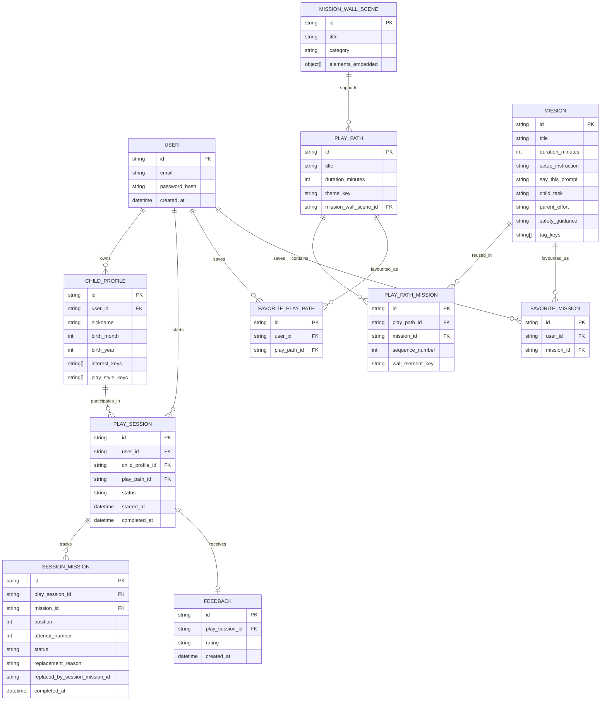

# Play Spark — Entity Relationship Diagram

**Version:** 1.3  
**Status:** Private-beta data design  
**Last updated:** 21 September 2026

## Purpose

This document describes the logical MongoDB data model for Play Spark. It supports the private beta while keeping the model ready for later expansion, including multiple child profiles per parent account.

The model is independent of the web runtime. In the approved beta architecture, only the Node.js/Express API accesses it; the React browser client never connects directly to MongoDB.

## ERD



## Collection summary

| Collection | Purpose |
|---|---|
| `users` | Parent accounts and authentication-related data. |
| `childProfiles` | Child age, optional nickname, interests, and play styles. |
| `playPaths` | Reusable themed activity plans, such as Car City — 20 minutes. |
| `missions` | Reusable individual activity missions. |
| `playPathMissions` | Connects a Play Path to its missions, controls sequence, and identifies the Mission Wall element to reveal. |
| `missionWallScenes` | Stores a complete Mission Wall background and its embedded visual elements. |
| `playSessions` | A record created each time a parent starts a Play Path. |
| `sessionMissions` | Completion, skip, or replacement status plus a preserved mission snapshot for each mission in a session. |
| `feedback` | Parent feedback submitted after a Play Session. |
| `favoritePlayPaths` | Complete Play Paths saved by a parent. |
| `favoriteMissions` | Individual missions saved by a parent. |

## Mission Wall design

Mission Wall elements are **embedded inside** a `missionWallScenes` document; there is no separate `wallElements` collection.

Example:

```text
Mission Wall Scene: Car City
  - scene background
  - road
  - delivery car
  - bridge
  - garage
  - parking area
```

Each `playPathMissions` document stores a `wallElementKey`, such as `road` or `bridge`. When that mission is completed, the application reveals the matching embedded element within the selected Mission Wall Scene.

## Key modelling decisions

- One parent account can support multiple child profiles in the data model, although the MVP interface shows one child profile.
- A Play Path contains two to four reusable Missions.
- A Mission can appear in multiple Play Paths.
- A Mission stores its small controlled `tagKeys` array directly; the beta has no `tags` or `missionTags` collections.
- Every started Play Path creates a separate Play Session.
- A replaced session mission remains in history with status `replaced`; its alternative uses the same plan position with a higher `attemptNumber`.
- Mission Wall history is reconstructed from completed `sessionMissions`; the application does not store a large image for every completed session.
- Parent feedback uses fixed options only; no free-text feedback is stored in the MVP.
- Recommendations use child interests, embedded mission tag keys, time, environment, parent effort, and feedback—not gender.


