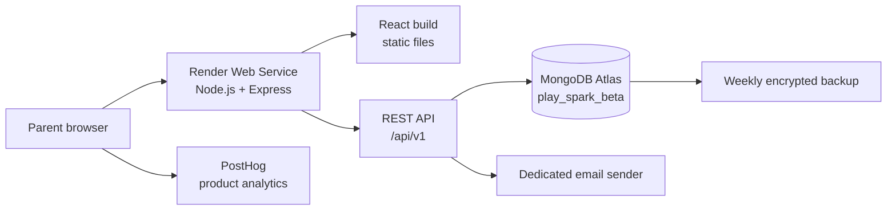

# System Architecture Document
## Play Spark — Private Beta Web Application

**Version:** 1.3  
**Status:** Approved private-beta architecture  
**Deployment model:** Single Node.js web service on free managed hosting  
**Last updated:** 21 September 2026

## 1. Architecture purpose

This document defines how Play Spark is structured, deployed, secured, and maintained for the private beta. Play Spark is a parent-led web application for screen-free preschool activities: a parent uses the website briefly while the child completes real-world activities away from the device.

## 2. Architecture principles

Play Spark uses a **modular monolith**: one deployable application, with internally separated modules.

- Keep the React frontend and Node/Express API in one private repository.
- Serve the React application and API from the same web origin.
- Store reusable activity content as data, not hard-coded screen logic.
- Keep authentication, profiles, recommendations, sessions, favourites, feedback, and analytics separate in the backend.
- Use shared TypeScript types and Zod schemas where useful.
- Use versioned routes such as `/api/v1/...`.
- Support multiple child profiles in the data model later, while exposing one active profile in the beta UI.
- Avoid microservices, AI recommendations, and a CMS during the beta.

## 3. Approved technology stack

| Layer | Technology | Purpose |
|---|---|---|
| Frontend | React, TypeScript, Vite | Parent-facing responsive interface |
| Backend API | Node.js 20+, Express, TypeScript | Accounts, activities, recommendations, sessions, favourites, and feedback |
| Web hosting | Render Web Service, free beta tier | Runs Express and serves the built React files |
| Database | MongoDB Atlas Free cluster | Separate development and beta data stores |
| Database access | Official MongoDB Node.js driver | Pooled access from a conventional Node runtime |
| Validation | Zod | Request, response, and form schemas |
| Authentication | Server-managed opaque sessions | Email/password accounts and secure cookies |
| Analytics | PostHog free | Minimal non-identifying metrics; no session recordings |
| Email | Dedicated no-cost sender address | Password-reset and account-deletion messages |
| Source control | One private Git repository | Code, shared types, content, and deployment configuration |

The Node/Express connection to the Atlas development database has been confirmed locally. The retired MongoDB Atlas Data API is not used.

## 4. High-level architecture

The browser receives React and calls `/api/v1` on the same origin. Express is the only component allowed to access MongoDB Atlas. Same-origin delivery avoids CORS configuration and keeps browser-session cookies straightforward.

## 5. Application modules

| Module | Responsibility |
|---|---|
| Authentication | Registration, login, logout, sessions, password change/reset, account deletion |
| Child profiles | Nickname, birth month/year, interests, play styles, preferences |
| Activity catalogue | Developer-managed Play Paths, missions, safety guidance, Mission Wall scenes |
| Recommendations | Rule-based ranking of suitable Play Paths |
| Play sessions | Started paths, mission completion, skips, replacements, pause/resume, history |
| Mission Walls | Visual progress for completed real-world missions |
| Favourites and feedback | Saved paths, saved missions, fixed parent feedback |
| Analytics | Minimal product events without child-identifying information |

## 6. Frontend architecture

React provides the parent-facing guest, authentication, child-profile, dashboard, Play Path detail, active-session, Mission Wall, favourites, history, and feedback screens. It can retain only short-lived UI state during a brief connectivity interruption.

The frontend never contains database credentials, email credentials, session secrets, or other server secrets. Vite builds it into `dist/`; Express serves this directory after API routes are registered.

## 7. Backend API architecture

Express provides the versioned REST API. It performs authentication, profile management, recommendation ranking, Play Session state changes, replacement selection, Mission Wall progress, favourites, feedback, Zod validation, ownership checks, MongoDB access, and essential account email delivery.

Example route groups:

- `/api/v1/auth/...`
- `/api/v1/child-profile/...`
- `/api/v1/play-paths/...`
- `/api/v1/recommendations/...`
- `/api/v1/play-sessions/...`
- `/api/v1/favourites/...`
- `/api/v1/feedback/...`

### Node–MongoDB connection design

The official MongoDB driver runs in a conventional Node.js process. The server creates its client lazily, maintains a small shared pool for the service lifetime, and clears a failed connection promise so a later request can retry safely. It must not create a new MongoDB client for every HTTP request.

The diagnostic connection-check endpoint returns only a safe status; it never returns a URI or low-level driver error.

## 8. Authentication and sessions

- Parents use email and password; beta does not require email verification.
- Passwords are stored only as strong one-way hashes.
- Login creates an opaque server-side session and sets a `Secure`, `HttpOnly`, `SameSite=Lax` cookie.
- Sessions expire after **14 days**; sign-out deletes the active server-side session immediately.
- Password-reset tokens are short-lived and single-use.
- Account deletion requires an exact typed email confirmation and then deletes owned data immediately.
- Children never have accounts or credentials.

No cross-site cookie or CORS exception is required because the frontend and API share one origin.

## 9. Guest samples

- Guests may complete two preselected sample Play Paths.
- Guest progress remains only in the browser and is never written to MongoDB.
- After two samples, the guest is asked to create an account or sign in.
- Guests cannot save profiles, favourites, feedback, or history.

This limit is a beta product decision, not strict access control.

## 10. Recommendation and session behaviour

Recommendations are rule-based. The service ranks content by age band, interests, play styles, duration, materials, mess/noise/space constraints, parent effort, and fixed feedback. If there is no exact match, it returns the best available option and labels the relaxed preference.

Starting a Play Path creates a `playSession` and immutable `sessionMissions` snapshots. Completing a mission reveals its Mission Wall element. A confirmed replacement records the original as `replaced` and creates a compatible replacement snapshot at the same plan position.

Active sessions can be resumed for 24 hours. When an active session is read after `expiresAt`, the server marks it expired; the beta does not require a separate paid scheduler.

## 11. Analytics and privacy

PostHog receives only non-identifying events: guest sample started/completed, sign-up completed, Play Path started/completed, filters selected, mission skipped/replaced, feedback selected, and favourite saved.

Analytics must not contain email addresses, child nicknames, birth data, free text, password-reset information, authentication tokens, or session recordings.

## 12. Security controls

- HTTPS is required for deployment.
- Render environment variables store secrets; secrets are never committed or sent to browser code.
- API requests are schema-validated, authenticated where required, and ownership-checked.
- Sign-up, sign-in, and password-reset endpoints are rate-limited.
- Express configures security headers, JSON body-size limits, and structured server logging.
- Atlas users have least-privilege access only to the intended Play Spark database.
- The browser never connects to MongoDB directly.
- Activity content includes parent supervision and safety guidance.

### Temporary beta network exception

The free Render service does not give this beta a static outbound IP address to allow-list in Atlas. Atlas may therefore require a temporary `0.0.0.0/0` access-list entry for the beta API.

This is accepted only for the small private beta, with TLS-only connections, unique long credentials, an isolated least-privilege database user, no direct browser access, and no credentials in source code. Replace the broad rule with a production-safe network arrangement before public release.

## 13. Deployment and operations

### Environments

| Environment | Atlas database | Parent data |
|---|---|---|
| Local development | `play_spark_dev` | No |
| Private beta | `play_spark_beta` | Yes |

Each environment uses its own least-privilege database user. Development data is never copied into beta.

### Render deployment flow

1. Commit reviewed changes to the private repository.
2. Render builds with `npm run build`.
3. Render starts Express with `npm run start`.
4. Configure `MONGODB_URI`, `MONGODB_DB_NAME`, session secret, and email/analytics settings as Render environment variables.
5. Run deployed health and database checks without exposing secrets.
6. Share the private beta URL with the invited parent group.

The free Render service can sleep after inactivity, so the first beta request after an idle period may be delayed. This is acceptable for the small private beta but not a production hosting model.

## 14. Backup and recovery

Atlas Free does not provide the backup capability required for a public service. For beta, export the beta database weekly, encrypt and store the export outside Atlas, restrict access, and test restoration before wider testing. Upgrade to automated backups before production.

## 15. Private-beta exclusions

- Native Android/iOS apps, child-facing screens, payments, subscriptions, advertisements, reminders, and notifications
- Admin CMS, AI recommendations, session recordings, automated backups, production-grade network isolation
- Multiple selectable child profiles in the UI

## 16. Production-readiness triggers

Review this architecture before public launch if usage grows, a custom domain or payments are added, multiple child profiles or a CMS are exposed, automated backups are required, broad Atlas access is removed, or native apps are planned.

## 17. Architecture decision summary

- React and TypeScript provide the web UI.
- Node.js, Express, and the official MongoDB driver provide the backend.
- One Render Web Service serves React and `/api/v1` from the same origin.
- MongoDB Atlas uses isolated `play_spark_dev` and `play_spark_beta` databases.
- Zod validates API and form schemas; server-side sessions use 14-day secure cookies.
- Recommendations stay rule-based; two guest sample Play Paths are permitted.
- PostHog analytics excludes identifying data and recordings.
- Manual encrypted weekly backups are required.
- Mission Wall elements stay embedded in `missionWallScenes`; mission labels stay embedded as `tagKeys`.
- The free Render tier is private-beta hosting only and is reassessed before production.

